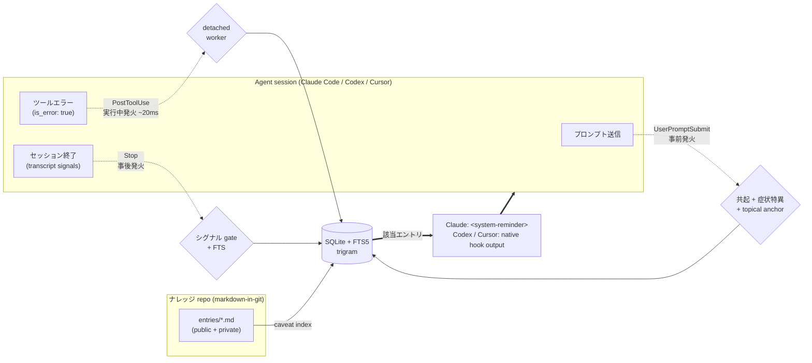

<p align="center">
  
  <br>
  <sub><em>この画像は、同じ罠をもう一度踏む前に立ち止まり、そこで得た注意を次の実行へ渡していく姿を表しています。</em></sub>
</p>

# Caveat

[](https://www.npmjs.com/package/caveat-cli)
[](https://github.com/kitepon/Caveat/actions/workflows/ci.yml)
[](LICENSE)
[](https://nodejs.org/)
[](https://github.com/kitepon/Caveat/releases)

> **同じ罠を二度踏まないために。** Caveat は Claude Code、Codex、Cursor のための長期記憶レイヤです。外部仕様の地雷を踏んで時間を溶かしたり、自分の repo 固有の独自設計を忘れたりしたとき、**一度書き留めておけば** 次に同じ場面に出くわした瞬間に自動で関連メモが浮上します（あなたが意識していなくても、AI が意識していなくても）。

🇬🇧 **English**: [README.md](README.md)

[kitepon.dev](https://kitepon.dev/)を運営する[クオ（@QLyun35332）](https://x.com/QLyun35332)が
開発・メンテナンスしています。

## 所有境界

本repositoryはCaveatのinstall、設定、状態、schema、migration、diagnostics、復旧、更新、
releaseを所有し、Caveat単独で動作します。製品横断の導入・互換契約は
[dotagents](https://github.com/kitepon/dotagents)が担当しますが、Caveatの製品状態を制御しません。
第三者CLIのMarkItDownは別区分です。

## 30 秒でわかる動作

```sh
npm install -g caveat-cli
caveat init                          # 状態と利用可能なClaude/Codex/Cursor連携を配備
```

macOS の Homebrew Node 環境では、hook command の Node パスに現在の実体と一致する安定 symlink
(`/opt/homebrew/bin/node`) を使います。`/opt/homebrew/Cellar/node/<version>/...` のような
version 固定パスを書かないため、Homebrew で Node が更新されても Claude Code / Codex / Cursor hook が
古い Node パスに取り残されません。

Claude Code、Codex、Cursor のいずれかの hook を有効にすると:

1. **プロンプト送信時** → `UserPromptSubmit` hook が **3 段の構造的ゲート**でマッチエントリを surface: 共起 + 症状セクション一致 + rare topical anchor。キーワード allowlist も stopword リストもなし。固有名詞だけの言及 (`RTX 5090 CUDA で何かやってる`) は silent、症状語彙と curated topic anchor (`cudaGetDeviceCount が 0 を返す`) が揃うと正解エントリだけ発火する。([詳細](CHANGELOG.md#0142--2026-05-06))
2. **ツールがエラー返却したとき** → Claude hook は detached worker を起動して非同期に検索し、結果は次の hook tick で載ります。Codex hook は現行 payload と transcript timing の都合で bounded foreground lookup を行い、次の `UserPromptSubmit` で結果を載せます。現在の Claude Code では failed-tool payload 用に `PostToolUseFailure` も登録します。
3. **セッション終了時** → `Stop` hook が transcript を解析し、客観的な「もがきシグナル」（ツール失敗、同一ファイル複数編集、Web 検索、Bash 再実行）を抽出。一つでも観測されれば、最終回答を汚さないよう reminder を次の hook tick 向けに compact して積み、次ターンで実行中の agent に既存エントリの更新か新規記録を促します。

Claude は Caveat reminder を `<system-reminder>` として受け取り、MCP tools で
search / record / update できます。Codex primary session は Codex native hook
runtime と Codex 用 formatter を使います。この経路は Caveat CLI を直接呼ぶ統合であり、
`codex-sidecar` を呼ぶ経路ではありません。sidecar は境界のある second opinion、
review、risk-check、isolated work 用に残します。

Cursorはnativeの`beforeSubmitPrompt` / `postToolUse` / `postToolUseFailure` / `stop`
を使い、既存のCursor hookを残したまま同じ検索・pending reminder契約を適用します。

reminderが案内する次の操作はhostごとに分かれます。ClaudeはCaveat MCP toolsを使います。
Codex / Cursorは`caveat show <id> --source <source>`で詳細を確認し、own knowledge repoの
Markdownを更新または新規作成して`caveat index`を実行します。community entryは購読物なので
localでは編集しません。

ナレッジ repo は **markdown-in-git** が真実の源。Obsidian の vault としてそのまま開けます。
privateなチーム共有は`caveat sync`、公開は`caveat publish`の封緘mirrorを使います。
中央サーバは存在しません — 信頼は「自動検査」ではなく「**社会的文脈**」で引きます
（あなた・チーム・組織が誰を購読するかで決まる、`caveat community add <github-url>`）。

## 競合との違い

| | **Caveat** | `.cursorrules` / `CLAUDE.md` / `AGENTS.md` | **Cline memory-bank** | ドキュメント RAG | Notion / Obsidian（手動） |
|---|---|---|---|---|---|
| 関連コンテキストの **自動 surface** | ✅ 3 発火点 hook | ❌ 常時 on、コンテキスト圧迫 | ❌ 各タスクで bank 全体を読む | ⚠️ 明示クエリ要 | ❌ 自分で思い出す |
| 罠ごとの粒度で取り出し | ✅ FTS5 共起 | ❌ モノリシックなファイル | ❌ フォルダ全体を一括ロード | ✅ embeddings | ❌ |
| 真実の源 | markdown-in-git | 単一の rules ファイル | workspace の markdown フォルダ | vector DB | プロプライエタリ |
| セッションから新規罠を記録 | ✅ Claude MCPまたはCodex / Cursorのown Markdown + `caveat index` | ❌ | ⚠️ "update memory bank"（手動トリガ） | ❌ | 手動 |
| AI が自覚しないもがきも検出 | ✅ transcript シグナル抽出 | ❌ | ❌ | ❌ | ❌ |
| 外部仕様の罠と repo 固有メモを混在管理 | ✅ public / private 2 tier | ⚠️ 分離なし | ⚠️ 分離なし | ⚠️ | ⚠️ |

**ステータス**: v0.19.0。Claude Code、Codex、Cursorにnative統合経路があり、GrokにもMCPを登録します。
個人および小規模チームが主な想定で、中央DBとinstall時の自動購読はありません。

<details>
<summary><strong>なぜ中央 DB を持たない？</strong>（v0.7 での方針転換）</summary>

以前のバージョンは中央の shared community DB を持ち、`caveat push`（fork + PR）と `caveat init` の自動購読で運用していました。これは廃止しました — **赤の他人の貢献を auto-validate するモデルが原理的に脆弱** だからです。LLM oracle を gate に置いても adversarial-gradient 攻撃で破られ、xz-utils 型の long-game は静的検査で検知不能。よって信頼は「自動検査」ではなく「社会的文脈」で引く方針に転換しました。詳細は [docs/01_plan.md](docs/01_plan.md) と [廃案になった自動マージ設計](docs/archive/auto-merge-design.md) 参照。
</details>

<details>
<summary><strong>「private」エントリって何？</strong>（v0.11 での tier 拡張）</summary>

「**第三者再現性**」で 2 tier に分けます:

- **Public** — 同じ外部ツール・仕様を使えば誰でも踏める罠（GPU ドライバ、ネイティブモジュールビルド、IDE の癖、バージョン制約等）。
- **Private** — コードを読むだけでは復元できない repo 固有の非自明文脈（意図的な非標準挙動、upstream 修正待ちのワークアラウンド、プロジェクト横断の個人的な慣習等）。

Claudeの`caveat_record`ツール記述とCodex / Cursorのnative reminderは同じ二項基準を使い、
ユーザーの明示指示が最優先です。
このtool repositoryのpre-commit gateはpublic dogfoodの`entries/`を守ります。ユーザー所有の
private repositoryには両tierを置け、公開境界は`caveat publish`が執行します。詳細は
[製品契約](docs/01_plan.md)を参照してください。
</details>

## アーキテクチャ



- **`markdown-in-git`** が真実の源。SQLite (FTS5 trigram) は再構築可能な派生 index で gitignore 済
- 3 つの発火タイミング (UserPromptSubmit / PostToolUse 系 / Stop) は **同じ共起 FTS ロジック** を異なる入力（プロンプト / ツールエラー / セッションシグナル）で再利用
- Claude ではマッチした既存エントリを最大 1 個の `<system-reminder>` でコンテキストに注入、Codex / Cursor では各native hook outputとして返す
- Codex primary hook adapter は `~/.codex/hooks.json` に `UserPromptSubmit` /
  `PostToolUse` / `Stop` を登録し、Codex payload parser と Codex stdout formatter
  だけを差し替えて同じ Caveat ロジックを使います。Claude hook stdout は 1 invocation
  につき最大 1 個の `<system-reminder>` block、Codex hook stdout は単一 JSON object
  とし、pending reminder は compact してから 1 つの host-specific context 文字列へ結合します
- Cursor primary hook adapter は`~/.cursor/hooks.json`へ`beforeSubmitPrompt` / `postToolUse` /
  `postToolUseFailure` / `stop`をupsertし、無関係なhookを保持します
- Claude-hosted session では、`codex-sidecar` が operational な project に限り、PostToolUse 系 / Stop の既存リマインダー末尾に Codex の second opinion を追記できます。Caveat の発火判定や記録思想は変えず、助言だけを外部化する補助経路です

## クイックスタート（NPM ユーザ）

```sh
npm install -g caveat-cli
caveat init                                                # 初回セットアップ
caveat search "rtx"                                        # ローカルエントリを検索
caveat community add https://github.com/acme-corp/caveats  # チームの repo を購読
caveat pull                                                # 購読 repo を git-pull + 再 index
caveat serve                                               # http://localhost:4242/ 読み取り専用ポータル
```

`caveat init` の動作:
- `~/.caveatrc.json` を生成（中身は空 `{}` — デフォルトは CLI 内部の定数）
- `~/.caveat/own/`（ナレッジ repo ルート）と `~/.caveat/index/caveat.db` を scaffold
- Claudeのuser設定へMCPを登録し、既存の環境変数と他の登録を保持
- `~/.claude/settings.json` に `UserPromptSubmit` / `PostToolUse` / `PostToolUseFailure` / `Stop` hook をマージ（既存エントリは保持、書き込み前にバックアップ作成）
- Codex / Cursor が利用可能なら製品所有hookを導入し、明示的なhook拒否設定は保持

Codexが利用可能、またはGrok・Cursorの設定ディレクトリが存在する場合は、同じ`init`がMCPも登録します。
NodeとCaveatの実行パスを登録し、既存の環境変数・timeout・無効化指定・他の登録は保持します。
設定を書き換える前にバックアップし、登録の読戻しが失敗した場合は非0終了します。
独自の設定先は`CODEX_HOME` / `GROK_HOME` / `CURSOR_HOME` / `CLAUDE_CONFIG_DIR`で指定できます。
`--skip-codex-hook`と`--skip-cursor-hook`はhookだけを省略し、MCP登録は行います。

privateな所有remoteの初期化または同期まで非対話で行う場合は、stdinを閉じて次の製品入口を一度だけ呼びます。

```sh
caveat init --sync --yes
```

この入口は現在`gh`で認証中のGitHub accountを使い、そのaccountの慣例的なprivate repositoryが
無ければ作成し、既存remoteならcheckoutまたはsyncしたうえで、利用可能な上記連携をすべて設定します。
再実行は冪等で、明示したsyncが失敗した時は非0終了します。呼出し側はCaveatの状態を直接判定せず、
GitHub identityを切り替えず、host別Caveat hook installerを前後に重ねません。

`--skip-claude` で Claude 連携をスキップ、`--dry-run` でプレビュー。`caveat uninstall` で `~/.caveat/` を残したまま Claude 連携だけ解除。**自動購読される中央 DB はありません** — 知識ソースは `caveat community add` で明示的に追加してください。

Codexだけを修復する時は`caveat codex-hook diagnostics`の後に`caveat codex-hook install`を使います。
diagnosticsはCodex hook runtimeが使えるかと、Caveat-owned hooksがinstall済みかを分けて表示します。

機械判定には`caveat factory-diagnostics --json`を使います。version付きschema
`caveat.native_factory_diagnostics.v1`は`connectors.cursor.compatibility_status`を公開し、引数なしの
既存Claude/Codex readiness契約は変えません。Cursorを必須とするhostは
`caveat factory-diagnostics --json --require-connector cursor`を実行します。Cursor connectorが
未導入、partial、または正規形でなければ`overall.status`が非readyとなり、commandも非0終了します。
呼出し側は`schema`を検証してtop-levelの`overall.status`とexit statusだけでgateを判定します。
必要hook集合、command形、timeoutはCaveatが所有し、`~/.cursor/hooks.json`やhook別fieldを外側で
再解釈しません。

### runtime errorの診断（明示opt-in）

runtime error収集はlocal限定で、既定では無効です。第二の設定ファイルやhost側controllerは
不要です。Caveat既存のユーザー設定`~/.caveatrc.json`へ次のキーを追加すると有効になります。

```json
{
  "runtimeErrors": true
}
```

同じJSON objectにある既存キーは残してください。キーなし、`false`、壊れたJSON、booleanの
`true`以外は収集無効として扱います。boundedなlocal storeの確認と保守は次の公開CLIを使います。

```sh
caveat runtime-errors diagnostics --json
caveat runtime-errors snapshot --json
caveat runtime-errors ack <cursor> --json
caveat runtime-errors resolve <fingerprint> --json
caveat runtime-errors reopen <fingerprint> --json
caveat runtime-errors compact --json
```

state fileはPOSIXでは`$XDG_STATE_HOME/caveat/runtime-errors.json`（既定
`~/.local/state/caveat/runtime-errors.json`）、Windowsでは
`%LOCALAPPDATA%\caveat\runtime-errors.json`です。diagnosticsが`unavailable`なら、所有者・権限を
直すか、壊れたfileを調査用に退避してから記録を再開します。knowledge DBの再indexやhookの
再installでは、この独立したruntime error storeは直りません。

### 共有 — 2 つの境界、2 つのコマンド

`visibility` は**配布範囲の上限**です。境界を執行するコマンドが 2 つあります:

- **`caveat sync`** — `~/.caveat/own/` 全体（public も private も）を**非公開**の git remote と同期します。自分の全端末で知識を揃える、あるいは組織内で共有する経路です（その private repo に push/pull できる人が境界の内側）。push 前に remote を probe し、**匿名で読める（＝公開）remote には push を拒否**するので、設定ミスで private が漏れません。

  ```sh
  caveat sync --init        # gh で <you>/Caveat-Private（非公開）を作成し初回 push
  caveat sync               # 以降: commit → pull --rebase → 再索引 → push
  caveat sync --init --repo https://github.com/acme-corp/Caveat-Private.git   # 組織 / 自前ホスト
  ```

- **`caveat publish`** — `visibility: public`だけを検査し、決定的なAES-256-GCM封緘bundleと
  生成READMEを公開repoへ一方向反映します。公開treeは`README.md`と
  `bundle/entries.caveat`だけで、showcase以外の本文を平文配置しません。不正entryや
  outbound scan失敗は全体を中止します。先に`publishTarget`、`sealedKeyserverUrl`、
  `sealedKeyId`を設定します。鍵契約は[`keyserver/README.md`](keyserver/README.md)が正です。

  ```sh
  caveat publish --init     # gh で <you>/Caveat-Public（公開）を作成
  caveat publish            # public entryを封緘 → 論理差分表示 → 確認 → push
  ```

他の人は`caveat community add <you>`の後に`caveat pull`で購読します。Caveatは宣言された
content keyを取得し、process memory内で復号して索引します。封緘はカジュアル閲覧とcrawlerへの
摩擦であり、動機ある人間に対する認証ではありません。中央serverも他人の自動mergeもありません。

## 開発（Caveat 本体への貢献）

```sh
corepack pnpm install
corepack pnpm -r build
cd apps/cli && corepack pnpm pack        # caveat-cli-<ver>.tgz
npm install -g ./caveat-cli-<ver>.tgz    # PATH に caveat が入る
```

npm release は `apps/cli` で `corepack pnpm publish` を使います。
`npm publish` を直接使うと packed manifest に `workspace:*` が残るため禁止です。
publish だけでは release 完了ではありません。
[`docs/04_release_checklist.md`](docs/04_release_checklist.md) に従い、fresh npm
install、Claude の新規 session smoke、Codex の新規 session smoke、CI、npm
registry 確認まで完了させます。

iterative 開発時は `apps/cli/` 内で `npm link` するとグローバル shim がローカルビルドを追従します。

詳細は英語版 [README.md](README.md) と [CONTRIBUTING.md](CONTRIBUTING.md) を参照してください。

## ライセンス

MIT
