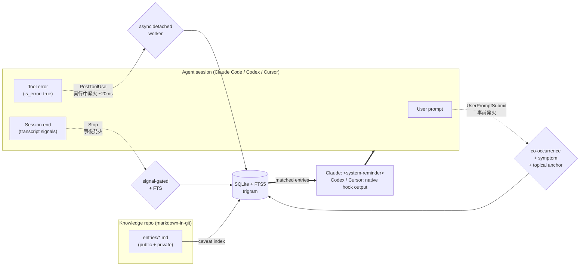

<p align="center">
  
  <br>
  <sub><em>This image represents stopping before the same trap is triggered again and carrying the warning learned there into the next execution.</em></sub>
</p>

# Caveat

[](https://www.npmjs.com/package/caveat-cli)
[](https://github.com/kitepon/Caveat/actions/workflows/ci.yml)
[](LICENSE)
[](https://nodejs.org/)
[](https://github.com/kitepon/Caveat/releases)

> **Stop rediscovering the same trap.** Caveat is a long-term memory layer for Claude Code, Codex, and Cursor: every time you bleed for an external-spec quirk or a repo-specific oddity, write it down once — and the next time anyone (you or your AI) is about to step on the same rake, the relevant note surfaces automatically.

🇯🇵 **日本語版**: [README.ja.md](README.ja.md)

Built and maintained by [Quo](https://x.com/QLyun35332) at [kitepon.dev](https://kitepon.dev/en).

## Ownership boundary

This repository owns Caveat's install, configuration, state, schema,
migrations, diagnostics, recovery, updates, and releases. Caveat operates
standalone. [dotagents](https://github.com/kitepon/dotagents) owns optional
cross-product integration and compatibility contracts; it does not control
Caveat's product state. The third-party MarkItDown CLI is managed separately.

## What it does in 30 seconds

```sh
npm install -g caveat-cli
caveat init                          # provisions state and available Claude/Codex/Cursor integrations
```

On macOS with Homebrew Node, generated hook commands use the stable
`/opt/homebrew/bin/node` symlink when it resolves to the current Node binary,
instead of a versioned `/opt/homebrew/Cellar/node/<version>/...` path. That keeps
Claude Code, Codex, and Cursor hooks alive across Homebrew Node upgrades.

With Claude Code, Codex, or Cursor hooks enabled:

1. **You type a prompt** → `UserPromptSubmit` hook surfaces matching entries via three structural gates: **co-occurrence + symptom-section match + rare topical anchor**. No keyword lists. Bare proper-noun mentions (`RTX 5090 CUDA で何かやってる`) stay silent; specific failure vocabulary plus a curated topic anchor (`cudaGetDeviceCount が 0 を返す`) fires the right entry. ([details](CHANGELOG.md#0142--2026-05-06))
2. **A tool returns an error** → Claude hooks spawn a detached worker that searches in the background; the matching caveat lands on the next hook tick (~20ms foreground latency). Codex hooks do a bounded foreground lookup and surface the result on the next `UserPromptSubmit`. Claude Code also registers `PostToolUseFailure` for current failed-tool payloads.
3. **The session ends** → `Stop` hook parses the transcript for objective struggle signals (tool failures, repeated edits, web searches, bash retries). If any are present, it queues a compact reminder for the next hook tick so the final answer is not cluttered, then nudges the active agent to update an existing entry or record a new one on the following turn.

Claude receives Caveat reminders as `<system-reminder>` blocks and can use the
MCP tools to search, record, and update entries. A primary Codex session uses
Codex's native hook runtime and Codex-formatted hook output. That path calls
Caveat CLI directly; `codex-sidecar` remains for bounded second opinions,
review, risk-check, and isolated work.

Cursor uses its native `beforeSubmitPrompt`, `postToolUse`,
`postToolUseFailure`, and `stop` events. Caveat formats the same retrieval and
pending-reminder results for Cursor without replacing unrelated Cursor hooks.

The next action in a reminder follows the active host. Claude uses the Caveat
MCP tools. Codex and Cursor inspect an entry with
`caveat show <id> --source <source>`, update or create Markdown in the own
knowledge repo, and run `caveat index`. Community entries are subscriptions and
are not edited locally.

The knowledge repo is plain markdown-in-git. Open it as an Obsidian vault. Use
`caveat sync` for a private team/ownership boundary and `caveat publish` for a
sealed public mirror. There is no central server — trust is defined **socially**,
by who you choose to subscribe to via `caveat community add <github-url>`.

## How it compares

| | **Caveat** | `.cursorrules` / `CLAUDE.md` / `AGENTS.md` | **Cline memory-bank** | RAG over docs | Notion / Obsidian (manual) |
|---|---|---|---|---|---|
| Surfaces context **automatically** | ✅ 3 hook firing points | ❌ always-on, fills context | ❌ re-reads the whole bank each task | ⚠️ on explicit query | ❌ manual recall |
| Granular per-trap retrieval | ✅ FTS5 co-occurrence | ❌ monolithic file | ❌ loads the entire folder | ✅ embeddings | ❌ |
| Source of truth | markdown-in-git | a single rules file | markdown folder in workspace | vector DB | proprietary |
| Records new traps from session | ✅ Claude MCP or Codex/Cursor own Markdown + `caveat index` | ❌ | ⚠️ manual "update memory bank" command | ❌ | manual |
| Catches struggle the AI didn't self-report | ✅ transcript signal mining | ❌ | ❌ | ❌ | ❌ |
| Mixes external-spec gotchas with repo-specific context | ✅ public / private tiers | ⚠️ no separation | ⚠️ no separation | ⚠️ | ⚠️ |

**Status**: v0.19.0. Claude Code, Codex, and Cursor have native integration
paths. Single-user and small-team workflows are the primary supported path.
There is no central DB and install does not auto-subscribe to one.

<details>
<summary><strong>Why no central shared DB?</strong> (v0.7 pivot)</summary>

Earlier versions ran a central shared community DB with `caveat push` (fork + PR) and auto-subscribe on `caveat init`. That model was retired because trust over arbitrary stranger contributions cannot be reliably automated — sophisticated malicious payloads survive static gates and adversarial-gradient attacks against any LLM-based oracle. xz-utils-style long games are undetectable by static review. Trust is now defined socially (you, your team, your org). See [docs/01_plan.md](docs/01_plan.md) and the [abandoned auto-merge design](docs/archive/auto-merge-design.md).
</details>

<details>
<summary><strong>What's a "private" entry?</strong> (v0.11 tier expansion)</summary>

Two tiers, distinguished by **third-party reproducibility**:

- **Public** — external-spec gotchas any third party running the same tool/spec can hit (GPU drivers, native-module builds, IDE quirks, version constraints).
- **Private** — repo-specific non-obvious context that code reading alone cannot reconstruct (intentional non-standard behavior, workarounds awaiting upstream fixes, cross-project personal conventions).

Claude's `caveat_record` tool description and the Codex/Cursor native reminder
use the same binary criterion; explicit user instruction always overrides. The
pre-commit gate in this tool repository protects its public dogfood `entries/`;
user-owned private repositories may contain both tiers and `caveat publish`
enforces the public boundary. Retrieval is deliberately flat. See the current
[product contract](docs/01_plan.md).
</details>

## Concept



- **`markdown-in-git` is the source of truth.** SQLite (FTS5 trigram) is a rebuildable derived index, gitignored.
- **Two sharing boundaries, enforced by the tool.** Your `~/.caveat/own/` is yours. `caveat sync` mirrors it (public + private) to a **private** remote for your machines/org — refusing any anonymously-readable remote. `caveat publish` mirrors **only public** entries to a **public** repo. Subscribers add a repo with `caveat community add <github-url-or-username>`; updates flow via `caveat community pull`. No central server; no automatic merge of strangers' entries — trust stays social.
- **`visibility: public | private`** is a distribution ceiling. Private repos may contain both tiers; `caveat publish` filters and seals the public boundary.
- **Agent integrations.** Claude Code gets an MCP server exposing 6 tools (`caveat_search` / `caveat_get` / `caveat_record` / `caveat_update` / `caveat_list_recent` / `caveat_pull`) plus hooks. Codex and Cursor get native hooks through their product-owned installers. All surfaces reuse the same retrieval gates — no hardcoded keyword lists:
  - **UserPromptSubmit** (事前発火): when you submit a prompt, tokenize it (path-stripping + self-identity + pure-hiragana glue removal + CJK group dedup), FTS the DB, and surface entries that pass **three structural gates** — (1) ≥ 2 distinct group matches (co-occurrence), (2) ≥ 1 match in the entry's `## Symptom` section (failure-state evidence), (3) ≥ 1 corpus-rarest prompt token in `topical_text` (title + tags + environment values, topic evidence). Bare proper-noun mentions like `RTX 5090 CUDA で何かやってる` stay silent; only specific failure-state vocabulary plus a curated topic anchor (`cudaGetDeviceCount`, `SQLITE_READONLY`, …) fires the gate. No hardcoded word lists.
  - **PostToolUse** (+ Claude **PostToolUseFailure**) (実行中発火): when a tool returns `is_error: true` or Claude Code emits a failed-tool `error` payload, Claude spawns a detached worker so the foreground hook returns in ~20ms. Codex performs a bounded foreground lookup because current Codex payloads and transcript timing make detached workers unreliable there. In both cases, the reminder lands on the next hook tick. In Claude-hosted sessions, an operational `codex-sidecar` can append Codex advice after Caveat's original text.
  - **Stop** (事後発火): parse the session transcript for objective struggle signals (tool failures, repeated file edits, web searches, bash retries). If any are present, queue a compact reminder for the next context-capable hook tick and nudge through that host's available action surface: Caveat MCP for Claude, or the Caveat CLI and own Markdown for Codex/Cursor. In Claude-hosted sessions, optional Codex advice can challenge or sharpen that nudge without replacing Caveat's trigger logic.
- **Codex primary hook adapter.** `caveat codex-hook install` registers
  `UserPromptSubmit`, `PostToolUse`, and `Stop` in `~/.codex/hooks.json` and
  enables `[features].hooks = true`. Existing `codex_hooks = true` installs are
  migrated to the canonical key. It reuses Caveat's existing search,
  pending-reminder, and stop-signal logic with Codex-specific payload parsing
  and stdout formatting. Claude hook stdout is at most one
  `<system-reminder>` block per invocation; Codex hook stdout is a single JSON
  object per invocation. Pending reminders are compacted before being joined
  into one host-specific context string.
- **Cursor primary hook adapter.** `caveat cursor-hook install` upserts
  `beforeSubmitPrompt`, `postToolUse`, `postToolUseFailure`, and `stop` in
  `~/.cursor/hooks.json`, preserves unrelated hooks, and uses Cursor-native
  output shapes for context injection and pending reminders.
- **Obsidian-compatible.** The knowledge repo is a valid Obsidian vault — open it as a folder, edit with Obsidian's graph/backlinks/Dataview, the tool re-indexes on `caveat index`.

## Layout

```
packages/core/        @caveat/core — DB (node:sqlite + FTS5 trigram), indexer, frontmatter,
                      env fingerprint, repository, record/update, community, paths,
                      shared hook retrieval logic (claudeHooks.ts; Claude name
                      retained for the canonical Claude contract)
apps/cli/             caveat-cli (published to npm) — bundled CLI with subcommands:
                        init / uninstall / index [--full] / search / list / stale / show /
                        stats / serve / mcp-server / hook <name> / community add|pull|list /
                        codex-hook install|uninstall|diagnostics|... /
                        cursor-hook install|uninstall|diagnostics|... /
                        factory-diagnostics [--require-connector cursor] /
                        codex-sidecar diagnostics|smoke|run|work-smoke
apps/mcp/             @caveat/mcp — stdio MCP server exposing 6 tools via
                      @modelcontextprotocol/sdk. Imported by caveat-cli as `mcp-server`
apps/web/             @caveat/web — Hono SSR read-only share portal (/, /g/:id, /community) +
                      custom markdown-it wikilinks plugin for [[slug]] → /g/slug rendering
hooks/                pre-commit-visibility-gate.mjs (run by .husky/pre-commit) — thin
                      re-export wrapper around @caveat/core's findBlockedFiles
.husky/               git pre-commit wiring (husky 9)
docs/00_overview.md      Documentation map and reading order
docs/01_plan.md          Current product, state, sharing, and ownership contract
docs/03_dual_agent_support.md
                      Claude/Codex/Cursor host contracts, sidecar policy, and smoke notes
docs/04_release_checklist.md
                      Required publish and post-publish verification checklist
docs/adr/            Architecture decision records
docs/archive/         Completed plans, handoffs, audits, release ledgers, and superseded drafts
rag/                  Research asset ledger; currently only INDEX.md
```

## Requirements

- **Node 22.5+** (for `node:sqlite`). Verified on Node 24.14 with bundled SQLite 3.51.2.
- WindowsではPowerShell 7（`pwsh.exe`）を使います。エラー収集用ストレージのACL処理も同じ入口です。
- **pnpm 10** via corepack (pinned in root `package.json`'s `packageManager`).
- **git** for community import (`simple-git` shells out to the system git).

## Quick start (NPM user)

```sh
npm install -g caveat-cli
caveat init                                                # one-time setup (see below)
caveat search "rtx"                                        # search your local entries
caveat community add https://github.com/acme-corp/caveats  # subscribe to a group repo
caveat pull                                                # git-pull subscribed repos and re-index
caveat serve                                               # http://localhost:4242/ read-only portal
```

What `caveat init` does:
- Writes `~/.caveatrc.json` (empty `{}` — defaults come from a constant in the CLI)
- Scaffolds `~/.caveat/own/` (your knowledge repo root) + `~/.caveat/index/caveat.db`
- Claudeのuser設定へMCPを登録し、既存の環境変数と他の登録を保持する
- Merges `UserPromptSubmit` / `PostToolUse` / `PostToolUseFailure` / `Stop` hook entries into `~/.claude/settings.json` (existing entries preserved; backup written before any change)
- Installs the product-owned Codex and Cursor hooks when those hosts are available, while preserving explicit hook refusal

CodexのCLIまたは設定ディレクトリ、Grok・Cursorの設定ディレクトリが存在する場合は、同じ`init`がMCPも登録します。
NodeとCaveatの実行パスを登録し、既存の環境変数・timeout・無効化指定・他の登録は保持します。
設定を書き換える前にバックアップし、登録の読戻しが失敗した場合は非0終了します。
独自の設定先は`CODEX_HOME` / `GROK_HOME` / `CURSOR_HOME` / `CLAUDE_CONFIG_DIR`で指定できます。
`--skip-codex-hook`と`--skip-cursor-hook`はhookだけを省略し、MCP登録は行います。

private remoteの初期化・同期も行う場合は、次の入口を使います。`--yes`は端末でも質問を挟まず、
公開ミラーは明示しなければ変更しません。新規remoteの作成には認証済みの`gh`が必要です。

```sh
caveat init --sync --yes
```

更新時も同じ入口で実行パスと連携設定を更新します。

```sh
npm install -g caveat-cli@latest
caveat init --sync --yes
```

It uses the GitHub account currently authenticated in `gh`, creates that
account's conventional private repository when absent, checks out or syncs an
existing remote, and configures every available integration above. Re-running
the command is idempotent, and an explicitly requested sync failure exits
non-zero. Callers do not inspect Caveat's state, switch GitHub identities, or
run host-specific Caveat hook installers around this entry.

Use `--skip-claude` to skip Claude Code wiring, or `--dry-run` to preview. `caveat uninstall` reverses Claude Code changes without touching `~/.caveat/`. **No central DB is auto-subscribed** — add knowledge sources explicitly with `caveat community add`.

For a targeted Codex repair, run `caveat codex-hook diagnostics` and then
`caveat codex-hook install`. Diagnostics reports hook availability separately
from whether Caveat-owned hooks are installed.

For a machine-readable product gate, use `caveat factory-diagnostics --json`.
The versioned `caveat.native_factory_diagnostics.v1` output includes
`connectors.cursor.compatibility_status`, while the base command preserves the
existing Claude/Codex readiness meaning. A host that requires Cursor runs
`caveat factory-diagnostics --json --require-connector cursor`; a missing,
partial, or non-canonical Cursor connector then makes `overall.status`
non-ready and the command exit non-zero. Consumers validate `schema`, then use
only top-level `overall.status` and the exit status for the gate. Caveat owns
the required Cursor hook set, command shape, and timeout; callers do not
reconstruct those details from `~/.cursor/hooks.json` or the per-hook fields.

### Runtime error diagnostics (explicit opt-in)

Runtime error collection is local and disabled by default. Enable it in
Caveat's existing user config, `~/.caveatrc.json`; no second config file or
host-level controller is required:

```json
{
  "runtimeErrors": true
}
```

Keep any existing keys in that JSON object. A missing key, `false`, malformed
JSON, or any value other than the boolean `true` leaves collection disabled.
Inspect and maintain the bounded local store with:

```sh
caveat runtime-errors diagnostics --json
caveat runtime-errors snapshot --json
caveat runtime-errors ack <cursor> --json
caveat runtime-errors resolve <fingerprint> --json
caveat runtime-errors reopen <fingerprint> --json
caveat runtime-errors compact --json
```

The state file is
`$XDG_STATE_HOME/caveat/runtime-errors.json` (default
`~/.local/state/caveat/runtime-errors.json`) on POSIX and
`%LOCALAPPDATA%\caveat\runtime-errors.json` on Windows. If diagnostics reports
`unavailable`, repair that file's owner/permissions or move a corrupt file aside
for inspection before recording again. Re-indexing the knowledge database or
reinstalling hooks does not repair this independent runtime error store.

### Sharing: two boundaries, two commands

`visibility` is a **distribution ceiling**. Two commands enforce it:

- **`caveat sync`** — sync your whole `~/.caveat/own/` (public *and* private entries) to a **private** git remote. This is how you keep your knowledge in step across your own machines, or share it inside an org — anyone with push/pull access to that private repo is inside your boundary. Before pushing, Caveat probes the remote and **refuses to push if it is anonymously readable** (a public repo), so private entries never leak by misconfiguration.

  ```sh
  caveat sync --init        # gh-creates <you>/Caveat-Private (private), first push
  caveat sync               # thereafter: commit → pull --rebase → reindex → push
  caveat sync --init --repo https://github.com/acme-corp/Caveat-Private.git   # org / self-hosted
  ```

  Once a private remote is configured, **Caveat also syncs on its own** — a gotcha you hit on one
  machine is worth little if it reaches the others two days later. A background worker runs the same
  cycle within a minute of recording an entry, and otherwise at most every 15 minutes when a session
  ends. It never blocks you, it obeys the same refuse-if-anonymously-readable rule, and repeated
  failures back off rather than stopping silently. Set `CAVEAT_AUTO_SYNC=off` to sync only by hand.

- **`caveat publish`** — scan only `visibility: public` entries, then generate a
  deterministic AES-256-GCM sealed bundle plus a generated README. The public
  mirror contains only `README.md` and `bundle/entries.caveat`; non-showcase
  entry text is not materialized as a plaintext tree. Invalid entries or a
  failed outbound scan abort the whole publish. Configure `publishTarget`,
  `sealedKeyserverUrl`, and `sealedKeyId` first; see
  [`keyserver/README.md`](keyserver/README.md).

  ```sh
  caveat publish --init     # gh-creates <you>/Caveat-Public (public)
  caveat publish            # seal public entries, show the logical diff, confirm, push
  ```

Others read your public repo with `caveat community add <you>` (a bare GitHub
username expands to `<you>/Caveat-Public`) then `caveat pull`. Caveat obtains the
declared content key and decrypts the bundle in process memory for indexing; the
sealed tier deters casual browsing and crawlers, but it is not authentication
against a motivated human. There is still no central server and no automatic
merge of strangers' contributions.

The `entries/` directory in this tool repository is intentionally retained as
dogfood and format examples. It is not the canonical published knowledge set;
that boundary is the generated `Caveat-Public` repository produced by
`caveat publish`.

### Using an existing knowledge repo instead of `~/.caveat/own/`

Write `~/.caveatrc.json`:

```json
{
  "knowledgeRepo": "/absolute/path/to/your/caveats-repo"
}
```

(v0.2+) `source_project` is always written as `null` by `caveat_record`. It used to be auto-inferred from cwd via a `projectRoots` config field, but that leaked per-user project names into publicly-shared knowledge repos and has been removed. Set it manually in the md file if you want personal traceability on private entries.

## Quick start (dev — contributing to Caveat itself)

```sh
corepack pnpm install
corepack pnpm -r build
cd apps/cli && corepack pnpm pack        # caveat-cli-<ver>.tgz
npm install -g ./caveat-cli-<ver>.tgz    # now `caveat` is on PATH
```

For npm releases, publish from `apps/cli` with `corepack pnpm publish`.
Do not use `npm publish` directly; pnpm normalizes workspace dev dependencies
in the packed manifest, while npm leaves `workspace:*` strings intact.
Release work is not done at publish time: follow
[`docs/04_release_checklist.md`](docs/04_release_checklist.md) through fresh npm
install, Claude/Codex new-session smoke, Cursor install/diagnostics smoke, CI,
and npm registry verification.

For iterative dev, `npm link` inside `apps/cli/` keeps the global shim tracking your local build.

### (Optional) Pre-commit gate on a public-only authoring repo

The tool repo has `.husky/pre-commit` wired to protect its public dogfood
`entries/`. Use the same gate only in a repository that is intentionally
public-only. Do not add it to the private repository managed by `caveat sync`;
that repository is allowed to contain both tiers, and `caveat publish` enforces
the public boundary.

```sh
cd /path/to/your/caveats-repo
npm init -y   # or pnpm init
npm install --save-dev husky
npx husky init

# Copy the gate script:
cp /path/to/Caveat/hooks/pre-commit-visibility-gate.mjs hooks/
# Edit .husky/pre-commit to exec that script (one line: `exec node "$(dirname "$0")/../hooks/pre-commit-visibility-gate.mjs"`)
```

The gate rejects any commit that stages an `entries/**/*.md` with
`visibility: private`. It is a dogfood/public-only repository guard, not the
normal private-sharing mechanism.

### (Optional) Open knowledge repo in Obsidian

Your knowledge repo (default `~/.caveat/own/`) is a valid Obsidian vault. `File → Open folder as vault`. Recommended plugins:

| Plugin | Purpose |
|---|---|
| **Templates** (core) | Settings > Templates → folder `.templates/`. Then `Insert template` inserts the frontmatter skeleton. |
| **Obsidian Git** | Sync your vault to GitHub from inside Obsidian. |
| **Dataview** | Frontmatter queries. E.g. `TABLE confidence, environment.gpu FROM "entries" WHERE outcome = "impossible"`. |

Caveats authored in Obsidian are picked up by `caveat index` on next run (FTS is eventually consistent; MCP `caveat_record` syncs immediately).

## Subscribing to other people's / team caveat repos

```sh
caveat community add https://github.com/alice/caveats-alice
caveat community pull         # refresh all subscribed repos
caveat community list
caveat community remove <handle>   # unsubscribe + purge db rows
caveat index                  # re-index to pick up new entries (or use `caveat pull` for the combined flow)

# Then search only their contributions:
caveat search "foo" --source community
```

URL validation is strict — only `^https://github.com/<org>/<repo>(\.git)?/?$` is accepted. GitLab / SSH / HTTP are rejected in v1.

## Knowledge repo format

Each caveat is a markdown file with YAML frontmatter. Example:

```markdown
---
id: rtx-5090-cuda-12-compat
title: RTX 5090 で CUDA 12.4 以前が初期化失敗する
visibility: public
confidence: reproduced          # confirmed | reproduced | tentative
outcome: resolved               # resolved | impossible
tags: [gpu, nvidia, cuda]
environment:
  gpu: RTX 5090
  cuda: ">=12.5"
source_project: llm-infer-bench
source_session: "2026-04-18T12:34:56Z/abcdef012345"
created_at: 2026-04-18
updated_at: 2026-04-18
last_verified: 2026-04-18
---

## Symptom
## Cause
## Resolution
## Evidence
```

The canonical entry shape is `Frontmatter` in
[`packages/core/src/types.ts`](packages/core/src/types.ts), the derived index is
[`packages/core/src/schema.sql`](packages/core/src/schema.sql), and MCP input
schemas live beside the handlers in [`apps/mcp/src/tools/`](apps/mcp/src/tools/).

## Development

```sh
corepack pnpm -r test
corepack pnpm -r typecheck
corepack pnpm -r build
```

Per-package:
```sh
corepack pnpm --filter @caveat/core test
corepack pnpm --filter caveat-cli test
corepack pnpm --filter @caveat/mcp test
corepack pnpm --filter @caveat/web test
corepack pnpm --filter @caveat/hooks test
```

Contributing: see [CONTRIBUTING.md](CONTRIBUTING.md).

## License

MIT
